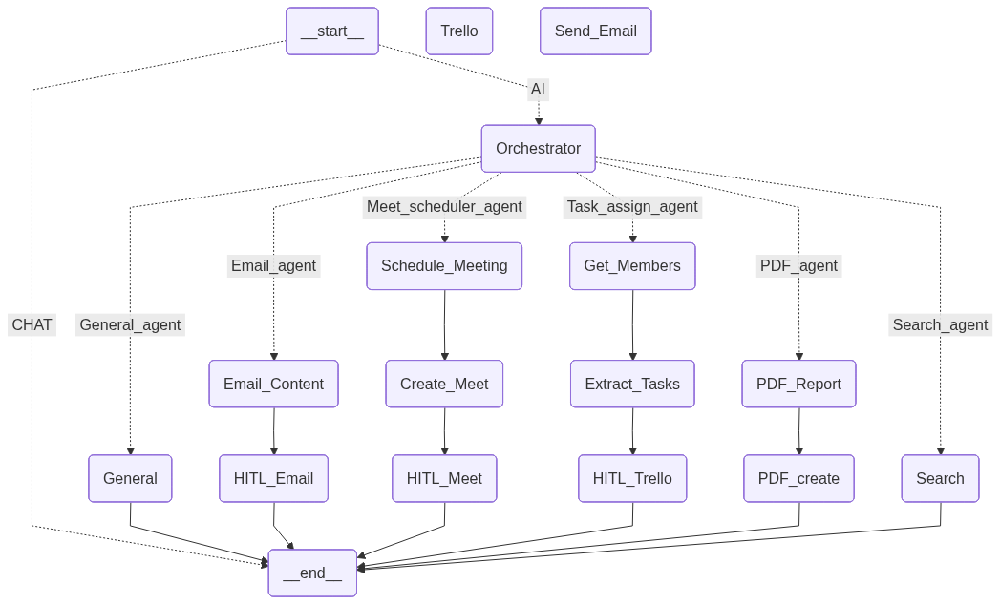
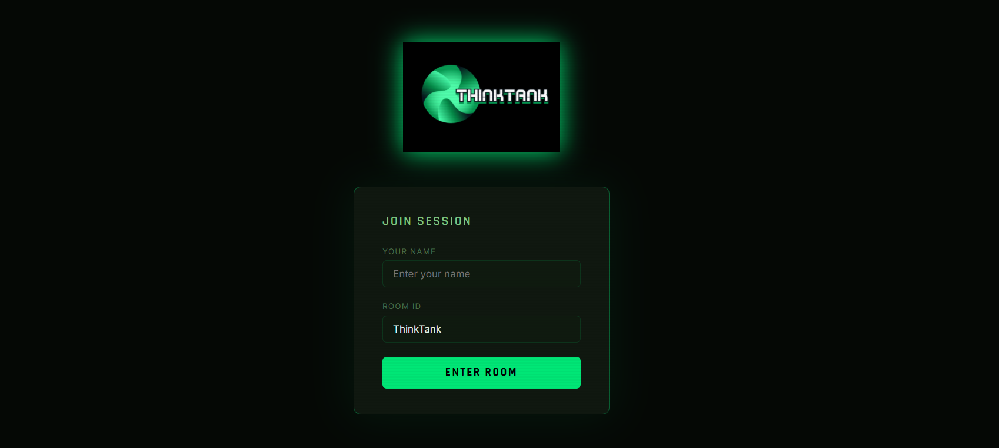

# ThinkTank

A real-time collaborative AI workspace where teams brainstorm together and summon an AI assistant on demand. Multiple users share a live chat room — the AI only activates when someone types `@AI`.

---

## Architecture



---

## Project Demi

[](https://youtu.be/7aKSvQkGTgc)

---
## What it does

ThinkTank is a multi-user WebSocket chat application backed by a LangGraph multi-agent system. Teams can discuss ideas freely, and when they are ready, any user can trigger the AI with `@AI` to perform tasks like drafting emails, scheduling meetings, generating insight reports, searching the web, or creating Trello boards — all without leaving the conversation.

Every action that involves real-world consequences (sending an email, creating a calendar event, pushing to Trello) requires **human approval** before it executes. All connected users must vote to approve before the action proceeds.

---

## Agents

| Agent | Trigger | What it does |
|---|---|---|
| **Orchestrator** | Every `@AI` message | Reads intent, selects the right agent, writes a detailed instruction |
| **Email Agent** | `@AI` + email intent | Drafts a professional email, shows it for review before sending |
| **Meet Scheduler** | `@AI` + meeting intent | Extracts meeting details, creates Google Calendar event with Meet link |
| **Task Assign Agent** | `@AI` + project/task intent | Breaks project into tasks, assigns to team members, creates Trello board |
| **PDF / Report Agent** | `@AI` + report intent | Analyses conversation, generates a visual PDF insight report |
| **Search Agent** | `@AI` + search intent | Searches the web using DuckDuckGo, ranks results with BM25 + embeddings |
| **General Agent** | Everything else | Handles general questions and conversation |

---

## Human-in-the-Loop (HITL)

Three agents pause for human review before taking action:

- **Email Review** — shows a Gmail-style draft with editable From, To, CC, Subject, and Body fields
- **Meeting Review** — shows scheduled meeting details and the Google Meet link
- **Trello Board Review** — shows an interactive Kanban board with editable cards and checklists

All users in the room must vote **Approve** before the action proceeds. A single **Reject** vote immediately sends it back for regeneration with feedback.

---

## Project Structure

```
ThinkTank/
├── backend/
│   ├── main.py                   # FastAPI app + WebSocket handler
│   ├── Graph.py                  # LangGraph graph definition
│   ├── condition_edge.py         # Pass_AI router + orchestrator router
│   └── Agents/
│       ├── Common_State.py       # Shared TypedDict state
│       ├── Orchestrator_Agent.py
│       ├── Email_agent.py
│       ├── Meet_scheduler_agent.py
│       ├── Assign_task.py
│       ├── PDF_create.py
│       ├── Search_Agent.py
│       └── general_agent.py
├── frontend/
│   └── thinktank.html            # Single-file frontend
├── static/
│   └── thinktank.png             # Logo
├── .env                          # API keys
└── requirements.txt
```

---

## Setup

### 1. Clone and create virtual environment

```bash
git clone <repo-url>
cd ThinkTank
python -m venv myenv
myenv\Scripts\activate        # Windows
source myenv/bin/activate     # Mac/Linux
```

### 2. Install dependencies

```bash
pip install fastapi uvicorn websockets langgraph langchain-openai \
            langgraph-checkpoint-sqlite aiofiles \
            google-auth-oauthlib google-api-python-client \
            requests trafilatura selenium rank-bm25 ddgs \
            scikit-learn langchain-text-splitters nltk pytz \
            python-dotenv pydantic
```

### 3. Configure environment variables

Create a `.env` file in the project root:

```env
OPENAI_API_KEY=sk-...
TRELLO_API=your_trello_api_key
TRELLO_TOKEN=your_trello_token
GOOGLE_MAIL=your_gmail_app_password
```

### 4. Google Calendar setup

Place your Google OAuth credentials file at the project root:

```
credentials.json    ← download from Google Cloud Console
```

On first run the browser will open for OAuth consent. After that `token.json` is created automatically.

### 5. Run

```bash
uvicorn backend.main:app --reload
```

Open `http://localhost:8000` in your browser.

---

## Usage

### Joining a room

Open the app, enter your name and a Room ID. Share the same Room ID with teammates — everyone who joins the same room shares one conversation and one LangGraph state.

### Chatting

Type normally to send messages to the room. All messages are visible to everyone and stored in the AI's memory.

### Triggering the AI

Include `@AI` anywhere in your message:

```
@AI write an email to the team about tomorrow's standup
@AI schedule a 1 hour meeting tomorrow at 3pm
@AI what are the latest trends in AI tooling
@AI create a trello board for our new mobile app project
@AI generate an insight report from our discussion
```

### Approving HITL actions

When the AI needs your sign-off, an overlay appears for all users in the room. Everyone must click **Approve** for the action to proceed. Any user can **Reject** with feedback to regenerate.

### Agent progress tracker

While the AI is working, the sidebar shows a live step-by-step progress tracker:

```
PROGRESS
● Orchestrator      ✓
● Email Agent       ✓
● Email Review      ⏸
```

---

## Key Design Decisions

**Shared LangGraph state** — all users write to the same `thread_id` in the checkpointer. Plain chat messages are stored via `update_state()` without triggering the graph, giving the AI full conversation context when `@AI` is called.

**Conditional graph entry** — `Pass_AI` is the first conditional edge. If the message contains `@AI` it routes to the Orchestrator. Otherwise the graph goes directly to `END` — no agent runs, the message is just stored.

**HITL voting** — the `WebSocket_Manager` tracks votes per interrupt. The graph only resumes via `Command(resume=...)` once all users approve, or immediately if anyone rejects.

**Agent streaming** — the server uses `graph.astream(stream_mode="updates")` so each node completion is broadcast to the frontend in real time as it happens.

---

## Environment Variables

| Variable | Description |
|---|---|
| `OPENAI_API_KEY` | OpenAI API key for all LLM calls |
| `TRELLO_API` | Trello API key |
| `TRELLO_TOKEN` | Trello OAuth token |
| `GOOGLE_MAIL` | Gmail app password for sending email |

---

## Dependencies

| Package | Purpose |
|---|---|
| `fastapi` + `uvicorn` | WebSocket server |
| `langgraph` | Multi-agent graph runtime |
| `langchain-openai` | LLM calls |
| `langgraph-checkpoint-sqlite` | Conversation memory persistence |
| `google-api-python-client` | Google Calendar integration |
| `trafilatura` + `selenium` | Web content extraction |
| `rank-bm25` | Keyword-based search ranking |
| `ddgs` | DuckDuckGo search |
| `scikit-learn` | Semantic similarity scoring |
